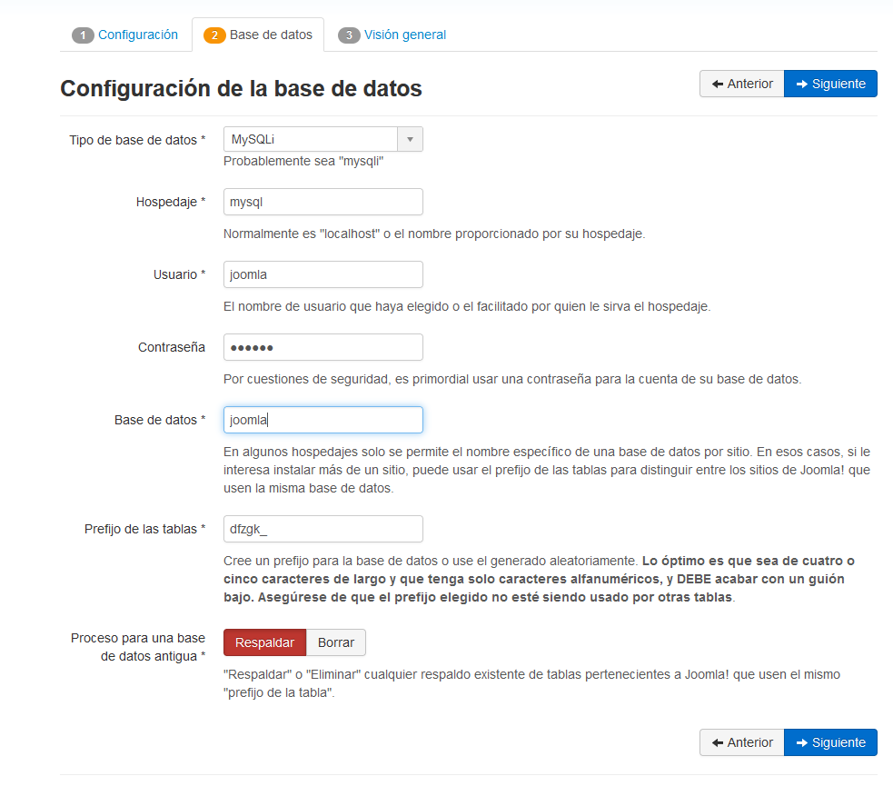

# Entorno de desarrollo para componentes Joomla! 3 con Docker

Este proyecto tiene como objetivo proporcionar un entorno de desarrollo preconfigurado para la creación de componentes de Joomla! 3 utilizando Docker.

## Requisitos

- Docker
- Docker Compose

## Instalación

1. Clonar el repositorio: git clone https://github.com/alejoasotelo/com_base.git
2. Ir al directorio del proyecto: cd com_base
3. Copiar el archivo de ejemplo .env.dist y renombrarlo a .env: `cp .env.dist .env`
4. Editar el archivo .env según tus necesidades.
5. Iniciar el contenedor de Docker: docker-compose up -d
6. Instalar Joomla (`solo la primera vez`). En los datos de configuración poner:
    - Hospedaje: `mysql`
    - Usuario: el valor de la variable `JOOMLA_DB_USER` del archivo .env
    - Contraseña: el valor de la variable `JOOMLA_DB_PASSWORD` del archivo .env
    - Base de datos: el valor de la variable `JOOMLA_DB_NAME` del archivo .env
    - 

## Uso

Una vez que el contenedor esté en ejecución, puedes acceder a tu componente Joomla! en el navegador web utilizando la URL http://localhost/.

## Configuración

El archivo .env contiene varias variables que puedes editar para configurar el entorno de desarrollo. Algunas de las variables más importantes son:

- `JOOMLA_DB_NAME`: El nombre de la base de datos.
- `JOOMLA_DB_USER`: El usuario de la base de datos.
- `JOOMLA_DB_PASSWORD`: La contraseña de la base de datos.

## Personalización

Puedes personalizar el entorno de desarrollo para satisfacer tus necesidades específicas editando los archivos docker-compose.yml y Dockerfile.

## Modo de uso

En la carpeta `component` hay un component base generado con `https://github.com/alejoasotelo/joomla-scaffolding/`. Es de ejemplo, eliminar y generar uno nuevo.
La estructura es simple:

- `component`
  - `admin`: archivos y carpetas del backend del componente
  - `site`: archivos y carpetas del frontend del componente
  - `base.xml`: archivo de instalación
  
Recomiendo usar `joomla-scaffolding` para crear el component inicial y ir agregando los MVC que se vayan necesitando. De esta manera se evitar tener que desarrollar tareas repetitivas como lo es crear los MVC (modelo-vista-controlador).

Una vez que se quiera deployar el proyecto ejecutamos `php build/build-component.php` desde el root del proyecto y nos va a generar el archivo de instalación `dist/com_base.zip`.
Este zip se instala en nuestro Joomla y listo, componente deployado. Es un deploy manual por el momento.

## Errores comunes

- `Bind for 0.0.0.0:3306 failed: port is already allocate`: revisar no tener algún proceso que esté ocupando el puerto 3306. Algún mysql corriendo de algun xampp/wampp, otro docker quizas? Lo mismo aplica para el puerto 80 (revisar apache, httpd, etc).
